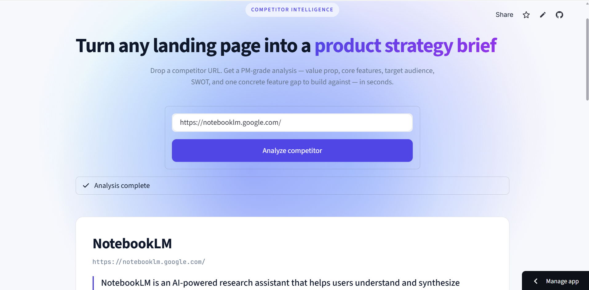

# Strategic PM Tool — Competitor Intelligence

Drop a competitor URL. Get a PM-grade strategy brief — value prop, core features, target audience, SWOT, and one concrete feature gap to build against. Export as a branded Battle Card PDF.

### [Open the live app →](https://strategic-pm-tool-ub3gamwfuyfcf9usjygvpe.streamlit.app/)

## What it does

- **Scrapes** the landing page (BeautifulSoup) — headings, CTAs, body copy
- **Analyzes** with Gemini using a Pydantic schema — structured JSON, no brittle parsing
- **Renders** a designed report: executive summary cards, color-coded SWOT grid, feature-gap callout
- **Exports** a one-page Battle Card PDF for sharing with sales or leadership

Stack: Python · Streamlit · google-genai · BeautifulSoup · Pydantic · fpdf2

## Architecture

| Module         | Responsibility                                              |
| -------------- | ----------------------------------------------------------- |
| `scraper.py`   | URL → raw HTML + title/meta                                 |
| `parser.py`    | HTML → clean text + headings + CTAs                         |
| `analyzer.py`  | Parsed page → Gemini (structured JSON) → `AnalysisResult`   |
| `models.py`    | Pydantic schemas — the LLM contract                         |
| `pdf_export.py`| `AnalysisResult` → PDF battle card                          |
| `app.py`       | Streamlit UI — thin orchestrator                            |
| `config.py`    | Layered secrets: `st.secrets` (cloud) → `.env` (local)      |

Data flow: `URL → scrape → parse → analyze → render + export`
